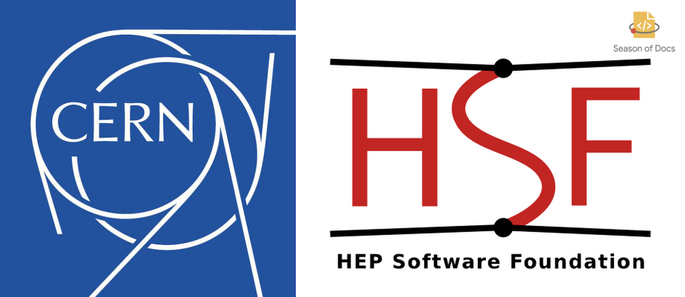

<h1 align="center"> Google-Season-of-Docs-2020 :book: </h1>

A full report of my Google Season of Docs 2020 with CERN-HSF </p1>

    
    <h2>
    Modernizing & Restructuring<a href="https://github.com/rucio/documentation"> documentation </a> for Rucio
    </h2>

	<a href="#project-abstract">Project Abstract</a> |
        <a href="#phase-updates">Phase updates</a> |
	<a href="#final-verdict">Final Verdict</a> |
	<a href="#prototype">Prototype</a> |
	<a href="#resources">Resources</a>

### Project abstract

Rucio is an open source data management system that has been developed for organizing, managing, and accessing 
large volumes of scientific data using customisable policies.
The framework has documentation that is spread across [dockerhub](https://hub.docker.com/u/rucio), [wikis](https://login.cern.ch/adfs/ls/?wa=wsignin1.0&wreply=https%3A%2F%2Ftwiki.cern.ch%2FShibboleth.sso%2FADFS&wct=2020-10-19T06%3A52%3A41Z&wtrealm=https%3A%2F%2Ftwiki.cern.ch%2FShibboleth.sso%2FADFS&wctx=cookie%3A1603090361_ae8d), [scientific articles](https://arxiv.org/abs/1902.09857),
[Google Drive](https://drive.google.com/drive/folders/1EEN8l1dFjDSgavPrAMMooDjEodHP7aU7), and [a website
hosted on ReadTheDocs](https://rucio.readthedocs.io/en/latest/) with [source in the code](https://github.com/rucio/rucio/tree/master/doc/source).
There were three major challenges identified - 
<ul>
  <li> Existing documentation had a dependency on the source code </li>
  <li> Disparate sources of documentation had no centralization </li>
  <li> Recent introduction of JSX modules didn't find support in current documentation-as-service tool </li>
 </ul>
 
The project aims to migrate to a documentation-as-service tool supporting JSX & simplifying the operational
support & management of documentation. Additionally, it would eliminate the dependency on source code &
centralize the disparate sources by linking them.

The target scope was inclusive of both the technical & qualitative aspects of documentation, thus contributing to 
a holistic improvement. The endeavour in the qualitative side is to make the user experience & content simpler for 
folks newer to the technology. The technical aspect mainly deals with migration to a new tool & improving the user
interface simpler to navigate & attractive.
 
 
**Mentors:** [Martin Barisits](https://github.com/bari12), [Mario Lassnig](https://github.com/mlassnig), [Thomas Beerman](https://github.com/tbeerman)
 
 
### Phase updates
 
#### :handshake: Community bonding (August 17, 2020 - September 13, 2020) 

During the Community bonding phase, cadence, agility, & sectioning of the project were the major points of discussion.

- :thought_balloon: :speech_balloon: **Cadence**: Weekly meetings to be held every Monday at 1.30 PM IST/10.00 AM CEST.

- :hammer:**Sectioning**: The project was divided into phases & sub-phases in order to aid with the agility. 

The major phases & sub-phases, per discussion, are as listed below:

<ul>
  <li> Research & Development (Overlaps with the Community Bonding phase)</li>
  <ul>
    <li> Understanding existing documentation-as-a-service tools </li>
    <li> Gathering requirements </li>
    <li> Researching different tools fitting the requirements </li>
    <li> Prototyping </li>
  </ul>
  <li> Modernizing (Overlaps with the Documentation Development phase)</li>
  <ul>
    <li> Prototyping different themes from UI/UX perspective </li>
    <li> Centralization </li>
    <li> Structuring of documentation </li>
  </ul>
  <li> Qualitative improvements (Overlaps with the Documentation Development phase) </li>
  <ul>
    <li> Fleshing out content structure </li>
    <li> Adding a documentation contribution guide </li>
    <li> Revamping Developer contribution guide </li>
    <li> Finishing design touches </li>
  </ul>
 </ul>
 
 - :runner: **Agility**: The agility for each sub-phase was decided to be around a week. Most of the sub-phases
 overlapped on account of the tasks involved.
 
Status update for the Community Bonding phase may be found [here](phases/Community-Bonding.md)
 
 #### :construction: Doc Development (September 14, 2020 - November 30, 2020)
 
 Per the sectioning decided in the Community Bonding phase, the status updates for each of the stages involved may be
 found [here](phases/Doc-Development.md).
 
 ###  :sunrise: Final Verdict 
 
 Final Evaluation Period (November 30, 2020 - December 5, 2020)
 
 ### :computer: Prototype
 
 [Rucio Doc](https://github.com/divya-mohan0209/rucio-doc) - This is a personal repository containing the source code &
 the compiled version on GH-pages. Once the prototype has been finalized, the work will be shifted to the [documentation
 repository for Rucio](https://github.com/rucio/documentation)
 
 ### :books: Resources
 
 
 ### Links
 
* [Google Season of Docs proposal - Divya Mohan]()
* [Project Link](https://developers.google.com/season-of-docs/docs/participants/project-cernhsf-ariadne) on GSoD website

 
